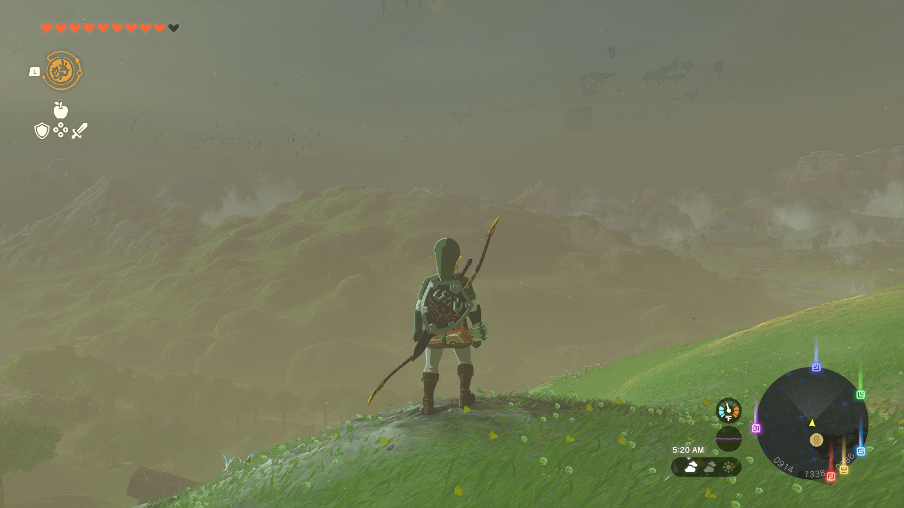
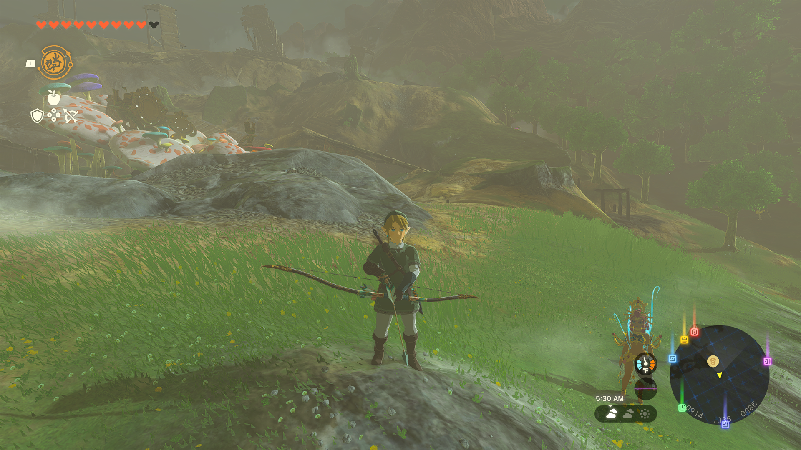
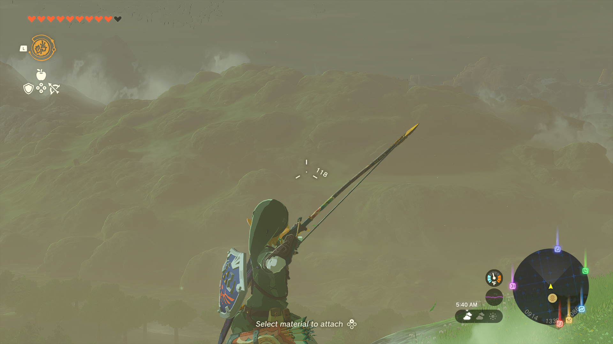

# Ganondorf's War Bow

This mod make the Demon King's Bow more powerful, as a real war bow should
be. The bow shoots farther, faster, and looks larger.
---

[Download here](https://github.com/JonoAugustine/Ganondorfs-War-bow/releases)

## Changes

<ul>
  <li>Increase Bow Size Scaling <code>(1x -&gt; 1.2x)</code></li>
  <li>Increase Arrow Initial Speed <code>(8 -&gt; 9)</code></li>
  <li>Increase Range <code>(30 -&gt; 250)</code></li>
  <li>Decrease Arrow Deceleration <code>(-0.1 -&gt; -0.05)</code></li>
  <li>Decrease Arrow Fall-Speed <code>(1 -&gt; 0.7)</code> | How fast the arrow drops when it hits terminal vel</li>
  <li>Decrease Arrow Terminal-Speed <code>(4 -&gt; 0) </code>| The speed at which the arrow has that sharp drop</li>
  <li>Decrease Bow Draw Speed <code>(1 -&gt; 0.7)</code> | Now takes slightly longer to draw the bow&gt;
  </li><li>Bow is now unbreakable</li>
</ul>

## _Warning_

I've tested only on 1.1.1, but afaik it should work with any version.

This mod changes a single file: <code>romfs/Pack/Actor/Weapon_Bow_166.pack.zs</code>;
any mod that changes this file might cause a conflict (e.g. Unbreakable Equipment).
You can delete the changed file in other mods or replace them with this mod's file
to use both.

---
If you wanna watch me making the mod (or at least most of making it) here ya go

https://www.youtube.com/watch?v=5hIZnXlsd3s&t=3458s
